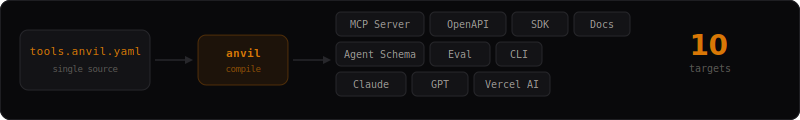

<p align="center">
  <picture>
    <source media="(prefers-color-scheme: dark)" srcset="website/public/banner.svg">
    
  </picture>
</p>

<p align="center">
  <a href="https://www.npmjs.com/package/@anvil-tools/cli"></a>
  <a href="https://github.com/64envy64/anvil/actions"></a>
  <a href="https://github.com/64envy64/anvil/blob/main/LICENSE"></a>
  <a href="https://anvil-sooty.vercel.app"></a>
</p>

<p align="center">
  <strong>The universal tool compiler for AI agents.</strong><br />
  One YAML definition. Ten compilation targets. Zero drift.
</p>

<br />

<p align="center">
  
</p>

---

## The Problem

Every agent runtime has its own tool format. You end up maintaining:

- An MCP schema for Claude Desktop
- An OpenAPI spec for your REST API
- TypeScript types for your SDK
- Hand-written docs that drift out of sync
- No eval coverage, no permission model, no agent-specific descriptions

**Anvil replaces all of them with a single source of truth.**

## Quick Start

```bash
npm install -g @anvil-tools/cli
anvil init my-tools && cd my-tools
anvil compile --target mcp            # generate MCP server
anvil serve --stub tools.anvil.yaml   # or run directly as MCP
```

Use in Claude Desktop — zero codegen needed:

```json
{
  "mcpServers": {
    "my-tools": {
      "command": "npx",
      "args": ["@anvil-tools/cli", "serve", "--stub", "tools.anvil.yaml"]
    }
  }
}
```

## Define Once

```yaml
anvil: "1.0"

service:
  name: github-tools
  version: "1.0.0"

tools:
  create_issue:
    description: Create a new GitHub issue
    agent:
      description: |
        Create a GitHub issue in a repository.
        Use when the user wants to file a bug or feature request.
      when_to_use:
        - User wants to create a bug report
        - User wants to file a feature request
      when_not_to_use:
        - User wants to comment on existing issue (use add_comment)
      tips:
        - Always include a clear title
        - Use markdown in the body
    parameters:
      owner:
        type: string
        required: true
        description: Repository owner
      repo:
        type: string
        required: true
      title:
        type: string
        required: true
      body:
        type: string
    permissions:
      - type: network
        target: api.github.com
        methods: [POST]
    side_effects: write
    cost: free
    examples:
      - name: bug_report
        input:
          owner: anthropics
          repo: claude-code
          title: "Bug: timeout on large files"
          body: "Completions time out after 30s on files >10MB."
        prompt: "Create a bug report for timeout issues"
```

## Compile Everywhere

No config file needed. Targets are built into the CLI:

```bash
anvil compile --target mcp                    # just MCP
anvil compile --target mcp,docs,anthropic     # pick targets
anvil compile --all                           # all 10 targets
```

| Target | Package | What it generates |
|--------|---------|-------------------|
| **MCP Server** | `@anvil-tools/target-mcp` | Production TypeScript MCP server with typed handlers |
| **OpenAPI 3.1** | `@anvil-tools/target-openapi` | Complete spec with schemas, auth, error responses |
| **Documentation** | `@anvil-tools/target-docs` | Markdown with parameter tables, agent guidance, examples |
| **Agent Schema** | `@anvil-tools/target-agent-schema` | LLM-optimized JSON — descriptions, tips, few-shot examples |
| **Eval Harness** | `@anvil-tools/target-eval` | Vitest test suite — schema validation + agent tool selection |
| **TypeScript SDK** | `@anvil-tools/target-sdk-ts` | Typed client with Zod runtime validation |
| **CLI** | `@anvil-tools/target-cli-gen` | Commander CLI with subcommands from tool definitions |
| **Anthropic** | `@anvil-tools/target-anthropic` | Claude Messages API tool format |
| **OpenAI** | `@anvil-tools/target-openai` | GPT function calling format |
| **Vercel AI** | `@anvil-tools/target-vercel-ai` | Vercel AI SDK `tool()` with Zod schemas |

## What Makes Anvil Different

**Agent-first semantics.** Tools declare `when_to_use`, `when_not_to_use`, `tips`, `cost`, `side_effects`, and `agent_description` — information agents need to make good tool selection decisions.

**Permissions as first-class.** Every tool declares what it needs. The runtime enforces it.

**Built-in eval.** Examples in your definition become test cases automatically. Schema validation, contract testing, and agent tool selection eval from one source.

**Compiler architecture.** Parse → IR → Target plugins. Like protobuf for tools. Adding a new target is implementing one interface.

## Schema Semantics

| Field | Purpose |
|-------|---------|
| `description` | Human-facing description |
| `agent.description` | LLM-optimized description with richer context |
| `when_to_use` / `when_not_to_use` | Guide agent tool selection |
| `tips` | Usage hints for better results |
| `permissions` | Declared per-tool, enforced at runtime |
| `side_effects` | `none` / `read` / `write` / `destructive` |
| `cost` | `free` / `low` / `medium` / `high` / `variable` |
| `errors` + `agent_hint` | Recovery strategies for agents |
| `examples` | Input/output pairs → eval + docs |

## Registry

Anvil includes a self-hosted registry. Start it locally or deploy to any server:

```bash
# Start the registry (seeds with example packages)
cd packages/hub && SEED=true npm run dev
```

Then publish, search, and install:

```bash
anvil login --token <token> --registry http://localhost:4400/api/v1
anvil publish tools.anvil.yaml
anvil search "github"
anvil install github-tools
```

## Runtime Middleware

```typescript
import { compose, validationMiddleware, rateLimitMiddleware } from '@anvil-tools/runtime';

const handler = compose(
  validationMiddleware(ir),   // validates input/output
  rateLimitMiddleware(ir),    // enforces rate limits
  cachingMiddleware(ir),      // caches by tool config
  circuitBreakerMiddleware(), // prevents cascading failures
)(myToolHandler);
```

## CLI Commands

| Command | Description |
|---------|-------------|
| `anvil init` | Scaffold a new project |
| `anvil validate` | Validate definitions with rich diagnostics |
| `anvil compile --target mcp` | Compile to targets (no config needed) |
| `anvil compile --all` | Compile to all 10 targets |
| `anvil serve --stub` | Run as MCP server (works with Claude Desktop, Cursor) |
| `anvil dev` | Watch mode — recompile on change |
| `anvil publish` | Publish to the registry |
| `anvil search` | Search for published tools |
| `anvil install` | Install a tool definition |
| `anvil login` | Save registry credentials |
| `anvil doctor` | Check project health |

## Examples

See [`examples/`](./examples) for complete definitions:

- **[GitHub](./examples/github)** — 5 tools: issues, search, PRs, comments, repo files
- **[PostgreSQL](./examples/postgres)** — queries, table schemas, guarded mutations
- **[Browser](./examples/browser)** — navigate, screenshot, extract links
- **[Weather](./examples/weather)** — current conditions, forecasts
- **[Linear](./examples/linear)** — issue tracking
- **[Filesystem](./examples/filesystem)** — read, write, list with permissions

## Architecture

```
packages/
  schema/              Core types, parser, validation, IR
  compiler/            Compilation pipeline + plugin interface
  cli/                 10 CLI commands
  runtime/             Middleware, validation, telemetry
  registry/            Registry client
  hub/                 Self-hosted registry server (SQLite)
  target-mcp/          MCP server generator
  target-openapi/      OpenAPI spec generator
  target-docs/         Markdown docs generator
  target-agent-schema/ LLM-optimized schema generator
  target-eval/         Test harness generator
  target-sdk-ts/       TypeScript SDK generator
  target-cli-gen/      CLI app generator
  target-anthropic/    Claude API tool format
  target-openai/       OpenAI function calling format
  target-vercel-ai/    Vercel AI SDK format
```

## Contributing

See [CONTRIBUTING.md](./CONTRIBUTING.md). Clone, `pnpm install`, `pnpm run build`, `pnpm run test`.

## License

[Apache 2.0](./LICENSE)
